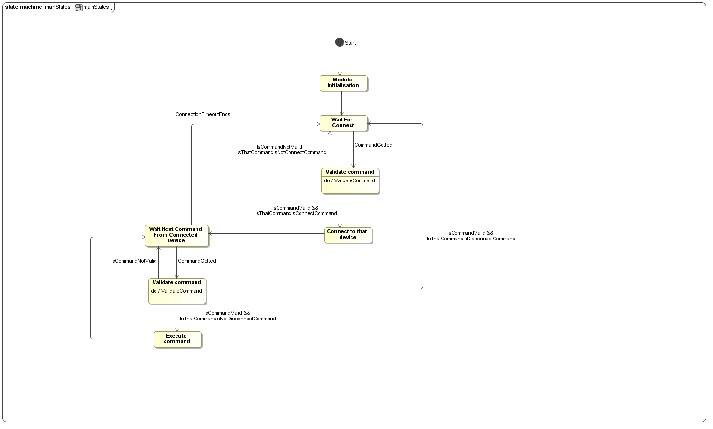

# Поток событий

<a name="protocol_working"/>

## Работа по протоколу

Данный вариант использования позволяет внешнему интерфейсу подключиться к платформе и посылать ей сообщения об управлении ее компонентами. Он описан с помощью диаграммы состояний:

## Получение неподдерживаемых команд

Данный вариант использования позволяет внешнему интерфейсу совершать ошибки при посылке сообщений (обычно происходит при подключении к платформе в тот момент, когда она запущена). Данный вариант является важной частью протокола и описан в пункте ["Работа по протоколу"](#protocol_working).

## Управление движением

Данный вариант использования позволяет внешнему интерфейсу управлять движением платформы через драйвер двигателя.  
Предусловие: внешнее устройство должно быть подключено в соответствии с протоколом.  
Основной и альтернативный потоки событий:  
1. Вариант использования начинается, когда была принята и распознана команда управления движением  
2. Платформа проверяет корректность параметров в команде. При принятии некорректных параметров платформа возвращает сообщение об ошибке и переходит в состояние ожидания следующей команды
3. Платформа конвертирует параметры команды в вид, принимаемый драйвером двигателя
3. Платформа отправляет данные драйверу двигателя
4. Платформа возвращает сообщение об успешности исполнения команды 
5. Вариант использования завершается

Постусловия: 
Платформа переходит в состояние ожидания следующей команды

## Получение информации с датчиков расстояния

Данный вариант использования позволяет внешнему интерфейсу получать информацию с датчиков расстояния платформы.  
Предусловие: внешнее устройство должно быть подключено в соответствии с протоколом.  
Основной и альтернативный потоки событий:  
1. Вариант использования начинается, когда была принята и распознана команда получения информации с датчиков расстояния  
2. Платформа проверяет корректность параметров в команде. При принятии некорректных параметров платформа возвращает сообщение об ошибке и переходит в состояние ожидания следующей команды
3. Платформа конвертирует параметры команды в вид, принимаемый переходной платой датчиков расстояния 
3. Платформа отправляет данные переходной плате датчиков расстояния 
3. Платформа получает информацию с переходной платы датчиков расстояния
3. Платформа конвертирует информацию с переходной платы датчиков расстояния в общепринятые единицы измерения расстояния (сантиметры)
4. Платформа возвращает сконвертированную информацию внешнему интерфейсу
4. Платформа возвращает сообщение об успешности исполнения команды 
5. Вариант использования завершается

Постусловия: 
Платформа переходит в состояние ожидания следующей команды

## Получение информации с датчиков линии

Данный вариант использования позволяет внешнему интерфейсу получать информацию с датчиков линии платформы.  
Предусловие: внешнее устройство должно быть подключено в соответствии с протоколом.  
Основной и альтернативный потоки событий:  
1. Вариант использования начинается, когда была принята и распознана команда получения информации с датчиков линии  
2. Платформа проверяет корректность параметров в команде. При принятии некорректных параметров платформа возвращает сообщение об ошибке и переходит в состояние ожидания следующей команды
3. Платформа конвертирует параметры команды в вид, принимаемый переходной платой датчиков линии 
3. Платформа отправляет данные переходной плате датчиков линии 
3. Платформа получает информацию с переходной платы датчиков линии
3. Платформа конвертирует информацию с переходной платы датчиков линии в соответствии с протоколом общения с вненшими интерфейсами: 0 - под датчиком светлая область, 1 - под датчиком темная область
4. Платформа возвращает сконвертированную информацию внешнему интерфейсу
4. Платформа возвращает сообщение об успешности исполнения команды 
5. Вариант использования завершается

Постусловия: 
Платформа переходит в состояние ожидания следующей команды

<a name="servo_get_info"/>

## Получение информации о текущем положении поворотной платформы

Данный вариант использования позволяет внешнему интерфейсу получать информацию о текущем положении поворотной платформы.  
Предусловие: внешнее устройство должно быть подключено в соответствии с протоколом.  
Основной и альтернативный потоки событий:  
1. Вариант использования начинается, когда была принята и распознана команда работы с сервоприводами  
2. Платформа проверяет корректность параметров в команде. При принятии некорректных параметров платформа возвращает сообщение об ошибке и переходит в состояние ожидания следующей команды
3. Платформа проверяет вид команды: получение информации о текущем положении поворотной платформы или изменение текущего положения сервоприводов в пространстве. В последнем случае выполняется поток событий ["Управление поворотной платформой"](#servo_manage) и текущий поток завершается
3. Платформа получает информацию о текущем положении поворотной платформы  
3. Платформа конвертирует полученную информацию в соответствии с протоколом общения с вненшими интерфейсами
4. Платформа возвращает сконвертированную информацию внешнему интерфейсу
4. Платформа возвращает сообщение об успешности исполнения команды 
5. Вариант использования завершается

Постусловия: 
Платформа переходит в состояние ожидания следующей команды

<a name="servo_manage"/>

## Управление поворотной платформой

Данный вариант использования позволяет внешнему интерфейсу устанавливать угол отклонения поворотной платформы от начального положения.  
Предусловие: внешнее устройство должно быть подключено в соответствии с протоколом.  
Основной и альтернативный потоки событий:  
1. Вариант использования начинается, когда была принята и распознана команда работы с сервоприводами  
2. Платформа проверяет корректность параметров в команде. При принятии некорректных параметров платформа возвращает сообщение об ошибке и переходит в состояние ожидания следующей команды
3. Платформа проверяет вид команды: получение информации о текущем положении поворотной платформы или изменение текущего положения сервоприводов в пространстве. В первом случае выполняется поток событий ["Получение информации о текущем положении поворотной платформы"](#servo_get_info) и текущий поток завершается
3. Платформа конвертирует параметры команды в вид, требуемый поворотной платформе для установки текущего отклонения  
4. Платформа отправляет данные о требуемом положении сервоприводам  
4. Платформа возвращает сообщение об успешности исполнения команды 
5. Вариант использования завершается

Постусловия: 
Платформа переходит в состояние ожидания следующей команды
