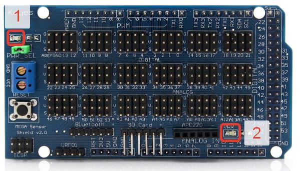

#### Возможность подключения к платформе

1. 1

2. Возможность подключения к платформе

3. Произведите следующие шаги:

   1. Включите платформу

   2. Дождитесь загрузки платформы (на изображении ниже светодиод 1 должен отключиться (перестать моргать), а светодиод 2 должен гореть)

      

   3. Запустите приложение и попробуйте подключиться к платформе

4. В приложении появится надпись "Connected"

5. В левом верхнем углу появилась надпись "Connected"

6. Прошел

#### Возможность принудительного отключения от платформы

1. 2
2. Возможность принудительного отключения от платформы по завершению работы с ней
3. Произведите следующие шаги:
   1. Подключитесь к платформе
   2. Выйдите из приложения, через которое подключались (нажмите кнопку "Quit")
   3. Попробуйте заново подключиться к платформе
4. В приложении, с помощью которого производилось подключение второй раз, появится надпись "Connected"
5. При нажатии кнопки "Exit" приложение завершилось. При втором открытии приложения надпись "Connected" появилась.
6. Прошел

#### Автоматическое отключение от платформы по истечению определенного промежутка времени

1. 3
2. Автоматическое отключение от платформы по истечению определенного промежутка времени
3. Произведите следующие шаги:
   1. Подключитесь к платформе
   2. Аварийно завершить работу приложения, через которое производилось подключение, либо принудительно разорвать соединение (выдернуть USB-провод или отключить Bluetooth-соединение)
   3. Подождите 10 секунд
   4. Попробуйте заново подключиться к платформе
4. В приложении, с помощью которого производилось подключение второй раз, появится надпись "Connected"
5. Соединение установилось
6. Прошел

#### Движение вперед

1. 4
2. Проверка движения платформы вперед
3. Произведите следующие шаги:
   1. Подключитесь к платформе
   2. Выберите в приложении "move forward". Если требуется, укажите скорость
4. Платформа должна поехать вперед с заданной скоростью
5. Платформа поехала вперед
6. Прошел

#### Движение назад

1. 5
2. Проверка движения платформы назад
3. Произведите следующие шаги:
   1. Подключитесь к платформе
   2. Выберите в приложении "move back". Если требуется, укажите скорость
4. Платформа должна поехать назад с заданной скоростью
5. Платформа поезала назад
6. Прошел

#### Разворот по направлению движения часовой стрелки

1. 6
2. Проверка возможности поворота платформы по часовой стрелке
3. Произведите следующие шаги:
   1. Подключитесь к платформе
   2. Выберите в приложении "turn right (clockwise)". Если требуется, укажите скорость
4. Платформа должна начать поворачиваться с заданной скоростью по часовой стрелке
5. Платформа повернулась по часовой стрелке
6. Прошел

#### Разворот против направления движения часовой стрелки

1. 7
2. Проверка возможности поворота платформы против часовой стрелки
3. Произведите следующие шаги:
   1. Подключитесь к платформе
   2. Выберите в приложении "turn left (anticlockwise)". Если требуется, укажите скорость
4. Платформа должна начать поворачиваться с заданной скоростью против часовой стрелки
5. Платформа повернулась против часовой стрелки
6. Прошел

#### Поворот сервоприводов в плоскости xy

1. 8
2. Проверка возможности поворота сервоприводов в плоскости xy
3. Произведите следующие шаги:
   1. Подключитесь к платформе
   2. Выберите в приложении "set horisontal servo angle in degree". Укажите корректный угол в градусах (от 0 до 180)
4. Платформа должна установить сервоприводы на указанный угол
5. Нет такого функцианала
6. Не прошел

#### Поворот сервоприводов в плоскости xz

1. 9
2. Проверка возможности поворота сервоприводов в плоскости xz
3. Произведите следующие шаги:
   1. Подключитесь к платформе
   2. Выберите в приложении "set vertical servo angle in degree". Укажите корректный угол в градусах (от 0 до 180)
4. Платформа должна установить сервоприводы на указанный угол
5. Нет такого функцианала
6. Не прошел

#### Получение текущего угла отклонения в сервоприводов в плоскости xy

1. 10
2. Получение текущего угла отклонения в сервоприводов в плоскости xy
3. Произведите следующие шаги:
   1. Подключитесь к платформе
   2. Выберите в приложении "set horisontal servo angle in degree". Укажите корректный угол в градусах (от 0 до 180)
   3. Выберите в приложении "get horisontal servo angle in degree"
4. В приложении должно появится значение, которое было введено в пункте 3.2
5. Нет такого функцианала
6. Не прошел

#### Получение текущего угла отклонения в сервоприводов в плоскости xz

1. 11
2. Получение текущего угла отклонения в сервоприводов в плоскости xz
3. Произведите следующие шаги:
   1. Подключитесь к платформе
   2. Выберите в приложении "set vertical servo angle in degree". Укажите корректный угол в градусах (от 0 до 180)
   3. Выберите в приложении "get vertical servo angle in degree"
4. В приложении должно появится значение, которое было введено в пункте 3.2
5. Нет такого функцианала
6. Не прошел

#### Некорректный поворот сервоприводов в плоскости xy

1. 12
2. Проверка возможности поворота сервоприводов в плоскости xy
3. Произведите следующие шаги:
   1. Подключитесь к платформе
   2. Выберите в приложении "set horisontal servo angle in degree". Укажите некорректный угол в градусах (больше 180)
4. Платформа не должна изменить текущий угол сервоприводов
5. Нет такого функцианала
6. Не прошел

#### Некорректный поворот сервоприводов в плоскости xz

1. 13
2. Проверка возможности поворота сервоприводов в плоскости xz
3. Произведите следующие шаги:
   1. Подключитесь к платформе
   2. Выберите в приложении "set vertical servo angle in degree". Укажите некорректный угол в градусах (больше 180)
4. Платформа не должна изменить текущий угол сервоприводов
5. Нет такого функцианала
6. Не прошел

#### Получение информации с датчиков линии. Белый лист

1. 14
2. Получение информации с датчиков линии. Проверка корректного определения белого цвета
3. Произведите следующие шаги:
   1. Подключитесь к платформе
   2. Положите под платформу лист белой бумаги
   3. Выберите в приложении "get fixed line value". Укажите номер датчика в диапазоне от 1 до 5
4. В приложении должно появится 0
5. Информация с датчиков была получена
6. Прошел

#### Получение информации с датчиков линии. Черный лист

1. 15
2. Получение информации с датчиков линии. Проверка корректного определения черного цвета
3. Произведите следующие шаги:
   1. Подключитесь к платформе
   2. Положите под платформу лист черной бумаги
   3. Выберите в приложении "get fixed line value". Укажите номер датчика в диапазоне от 1 до 5
4. В приложении должно появится 1
5. Нет такого функцианала
6. Не прошел

#### Получение информации с датчиков расстояния

1. 16
2. Получение информации с датчиков расстояния
3. Произведите следующие шаги:
   1. Подключитесь к платформе
   2. Подставьте перед центральным датчиком расстояния какой-нибудь непрозрачный предмет, например книгу, на расстоянии приблизительно 15 сантиметров
   3. Выберите в приложении "get fixed distance value". Укажите номер датчика 3
4. В приложении должно появится значение от 10 до 19
5. Информация с датчиков была получена
6. Прошел

#### Проверка времени жизни от батареи

1. 17
2. Проверка времени жизни от батареи.
3. Произведите следующие шаги:
   1. Зарядите аккомуляторную батарею платформы до 100%
   2. Подключитесь к платформе
   3. Повзаимодействуйте с платформой 5 минут
4. Платформа все еще должна работать
5. Платформа реагировала на взаимодействие
6. Прошел

#### Проверка времени реакции на любую команду

1. 18
2. Проверка времени реакции на любую команду. Она должна составлять не более 1 секунды
3. Произведите следующие шаги:
   1. Подключитесь к платформе
   2. Выполните любую команду
4. Платформа должна среагировать (вернуть ответ или совершить действие) быстрее, чем за 1 секунду
5. Платформа реагирует на команды
6. Прошел

### Выводы

Выполняются пункты: 1-7, 14, 16, 17, 18.

| Атрибут качества               | Результат(в %) |
| ------------------------------ | -------------- |
| Функциональная полнота         | 56             |
| Функциональная корректность    | 56             |
| Временная характеристика       | 61             |
| Доступность                    | 59             |
| Защита от ошибок пользователей | 0              |
| Модульность                    | -              |
| Устанавливаемость              | -              |
| Заменяемость                   | 56             |

Видно, что продукт не обладает защитой от ошибок пользователя.