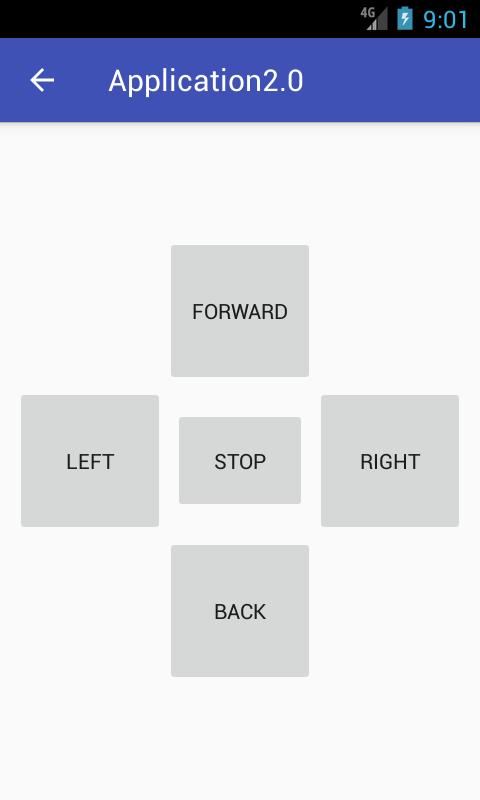

# Требования к проекту

1. Введение
2. Требования пользователя
	1. Программные интерфейсы
	2. Интерфес пользователя
	3. Характреристики пользователей
	4. Предположения и зависимости
3. Системные требования
	1. Функциональные требования
	2. Нефункциональныые требования

## Введение 
Название проекта: Android приложение для аппаратной платформы trackPlatform(далее аппаратная платформа или просто платформа). 
Вид проекта: программное обеспечение. 
Назначение данного проекта - это создание приложения для управления аппаратной платформой trackPlatform. 

## Требования пользователя
### Программные интерфейсы
Приложение должно взаимодействовать с прошивкой аппаратной платформы по приведенному ниже протоколу. 
Взаимодействие с прошивкой будет осуществлятся по беспроводной связи(через Bluetooth).
#### Протокол взаимодействия с аппаратной платформой 
Для взаимодействия с платформой требуется реализовать протокол, который будет принимать команды и отвечать на них.  
Формат любой посылки (на прием или передачу):  
*<размер данных> <данные> <контрольная сумма>*  

| Элемент команды | Размер | Описание |
|:---|:---|:---|
| Размер данных | 1 байт | Размер данных в байтах (пересылается в двоичном виде) |
| Данные | До 255 байт включительно (ограничено возможностями поля "Размер данных") | Пересылаемые данные |
| Контрольная сумма | 2 байта | Контрольная сумма, рассчитанная по алгоритму CRC-16 IBM (полином версии 0x8005) |

Формат данных команды (отправляется из приложения через API на устройство):  
*<контроллер> <команда контролера> <параметры команды (если требуется командой)>*  

| Элемент команды | Описание |
|:---|:---|
| Контроллер | выбор контроллера (контроллер движения, датчиков, сервопривода или связи) |
| Команда контроллера | команда контроллеру (например: движение вперед) |
| Параметры команды | необязательный параметр, обычно одно или несколько чисел в виде строки (а не в двоичном виде), разделяемые символом-разделителем и которые прилагаются к команде |

Формат данных ответа полностью зависит от команды, на которую платформа будет отправлять ответ.
Ответы также могут быть управляющими (синхронизирующими). Существует два вида управляющих ответов:  
- OK
- ERROR

Первый - утвердительный, второй - отрицательный.  
При полном приеме команды от приложения будет сформирован ответ: 
утвердительный - при принятии команды без повреждений, отрицательный - в случаях 
повреждения посылки либо принятии команды с несоответствующим форматом.
При посылке отрицательного ответа на команду платформа переходит в режим ожидания команды.
Также, по завершению выполнения команды, будет возвращен один из управляющих ответов. 
Только после этого настоятельно рекомендуется посылать следующую команду.

### Интерфес пользователя

### Характреристики пользователей 
Данное приложение предназначено для пользователей имеющих базовые знания операционной системы Android. 
Пользователь должен уметь включать и отключать Bluetooth на своем устройстве, а также уметь подключиться 
к определенному устройству через Bluetooth. Также пользователю необходимо иметь доступ к самой аппаратной 
платформе.

### Предположения и зависимости
На данные требования могут повлиять изменения в интерфейсе пользователя. Также на требования может 
влиять добавление новых функциональных возможностей.

## Системные требования

### Функциональные требования
1. Поддержка беспроводной связи с платформой через Bluetooth.
2. Получение и вывод информации с датчиков линии.
3. Получение и вывод информации с датчиков расстояни.
4. Управление гусеницами платформы.
	1. Движение веперд.
	2. Движение назад.
	3. Поворот по часовой стрелке.
	4. Поворот против часовой стрелке.
	5. Полная остановка.
5. Управление сервоприводами платформы.
	1. Установка угла отклонения для плоскости xy.
	2. Установка угла отклонения для плоскости xz.
	3. Получение угла отклонения по плоскости xy.
	4. Получение угла отклонения по плоскости xz.
6. Выбор языка(русского или английского).
7. Выбор нескольких версий прошивки платформы.

### Нефункциональныые требования
Для данной системы важна надежность доставки сообщения. Так как если аппаратной платформе будет отправлено 
движение вперед, но команда "stop" будет потеряна, то платформа может совершить лишнее движение, которое может привести 
к столкновению и, как следствие, порче оборудования. Под надежностью подразумевается возможность проверки на подленность 
полученной команды(контрольная сумма),а также ответ на команду, который позволяет понять была ли она выполнена.